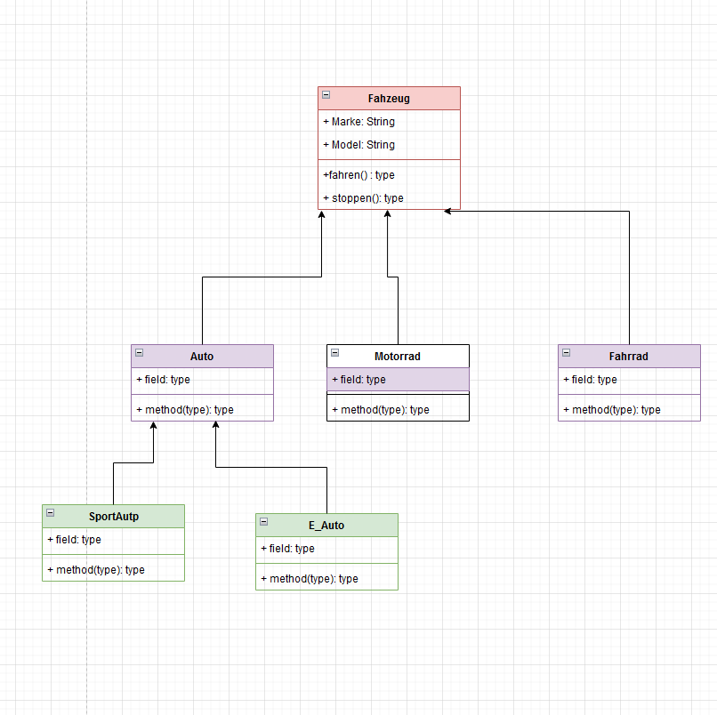

### Aufgabe: Vererbung in UML-Diagrammen

Erstellen Sie UML-Diagramme für die folgenden Themen, um das Konzept der Vererbung darzustellen:
- **Tiere**
- **Mitarbeiter**
- **Elektronikgeräte**
- **Fahrzeuge**
- **Personen**

#### Anforderungen:
1. Jede Diagrammgruppe sollte:
    - Eine **Oberklasse** enthalten, die allgemeine Attribute und Methoden definiert.
    - **Mindestens drei Unterklassen**, die spezifische Attribute und Methoden hinzufügen.
2. Verwenden Sie:
    - **Attribute** für gemeinsame und spezifische Eigenschaften.
    - **Methoden** zur Darstellung von Verhalten, das entweder geteilt oder einzigartig ist.
3. Zeichnen Sie die **Beziehungen** zwischen Oberklasse und Unterklassen mithilfe von UML-Pfeilen, um die Vererbung darzustellen.

---

#### Beispiel: Fahrzeuge

1. **Oberklasse**: Fahrzeug
    - Attribute: `Marke`, `Modell`
    - Methoden: `fahren()`, `stoppen()`

2. **Unterklassen**:
    - **Auto**:
        - Spezifische Attribute: `anzahlTüren`
        - Spezifische Methoden: `parken()`
    - **Motorrad**:
        - Spezifische Attribute: `helmPflicht`
        - Spezifische Methoden: `beschleunigen()`
    - **Fahrrad**:
        - Spezifische Attribute: `anzahlGänge`
        - Spezifische Methoden: `bremsen()`

---

Erstellen Sie ähnliche Diagramme für die anderen Themen und verwenden Sie UML-Standards für die Darstellung von Klassen, Attributen und Methoden.
